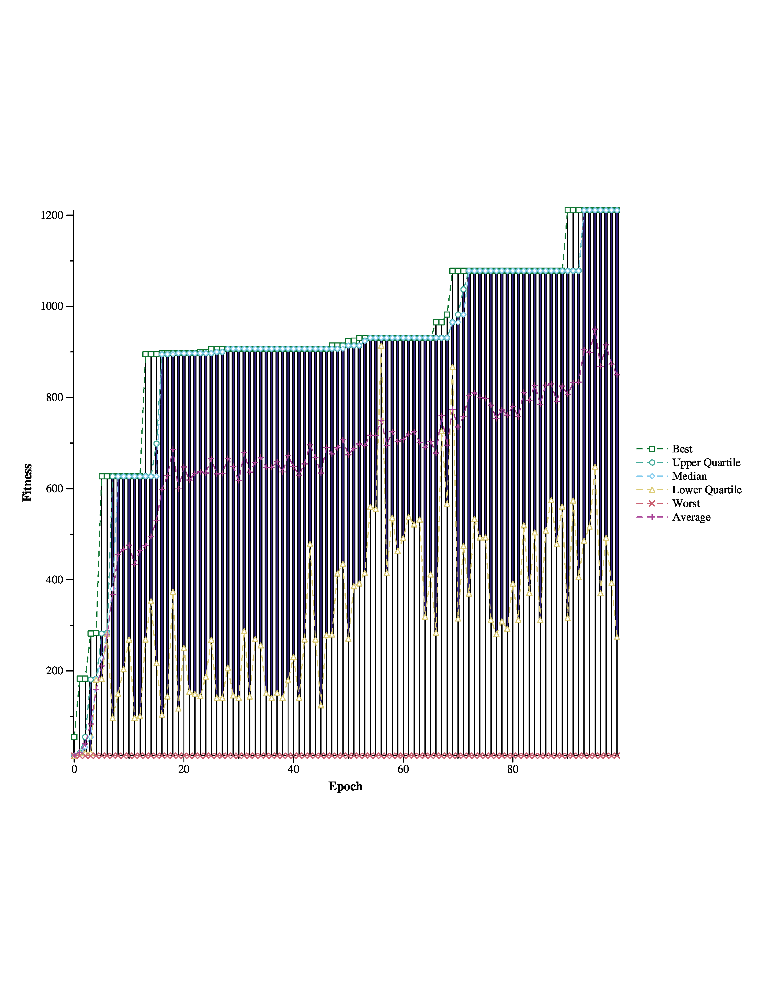

# EONS jgraph utility

A python script that takes the stdout of EONS and creates a pretty graph.

## Dependencies
- [jgraph](https://web.eecs.utk.edu/~jplank/plank/jgraph/jgraph.html)
- python3 and numpy
- EONS

## Usage
```
usage: eons_graph.py [-h] [-xs XSIZE] [-ys YSIZE] [-min]
                     [-sc] [-bo] [-lq] [-med] [-uq] [-max]
                     [-avg]
                     filename

Creates a postscript graph from the EONS standard output

positional arguments:
  filename              EONS standard output file

options:
  -h, --help            show this help message and exit
  -xs XSIZE, --xsize XSIZE
                        size of x axis
  -ys YSIZE, --ysize YSIZE
                        size of y axis
  -min, --graph_min     Graph the minimum fitness of each
                        epoch
  -sc, --graph_scatter  Graph a scatter plot of all
                        fitnesses
  -bo, --graph_box_and_whiskers
                        Graph a box of whisker plot of
                        fitnesses of each epoch
  -lq, --graph_lq       Graph the lower quartile fitness of
                        each epoch
  -med, --graph_med     Graph the median fitness of each
                        epoch
  -uq, --graph_uq       Graph the upper quartile fitness of
                        each epoch
  -max, --graph_max     Graph the maximum fitness of each
                        epoch
  -avg, --graph_average
                        Graph the average fitness of each
                        epoch
```

## Usage Example
```python3 eons_graph.py populationdata.txt -bo -min -lq -med -uq -max -avg > asdf.ps && ps2pdf asdf.ps && convert -density 300 asdf.pdf -quality 100 asdf.jpg```

`populationdata.jpg`:

